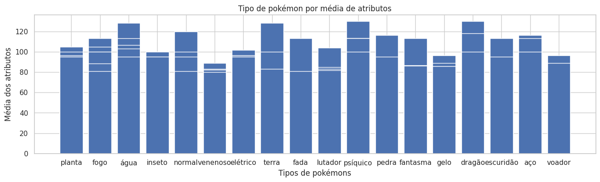
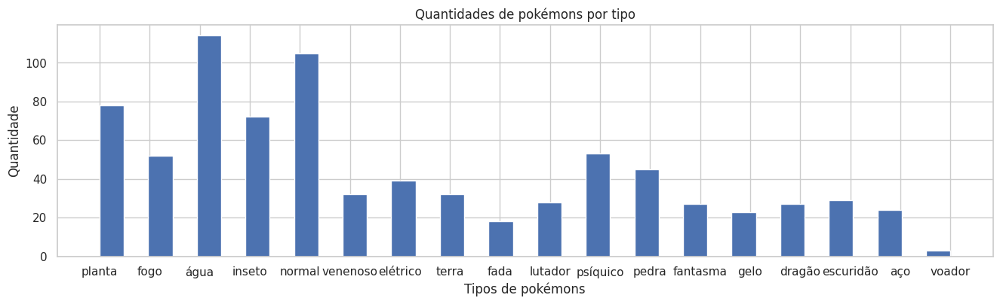
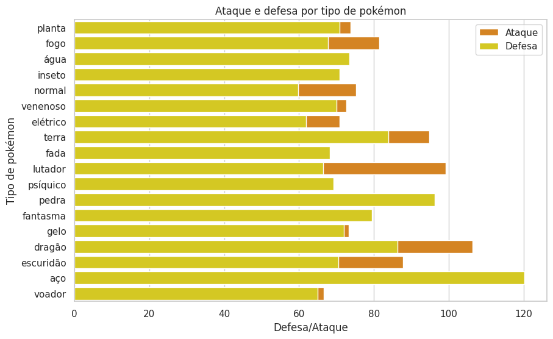
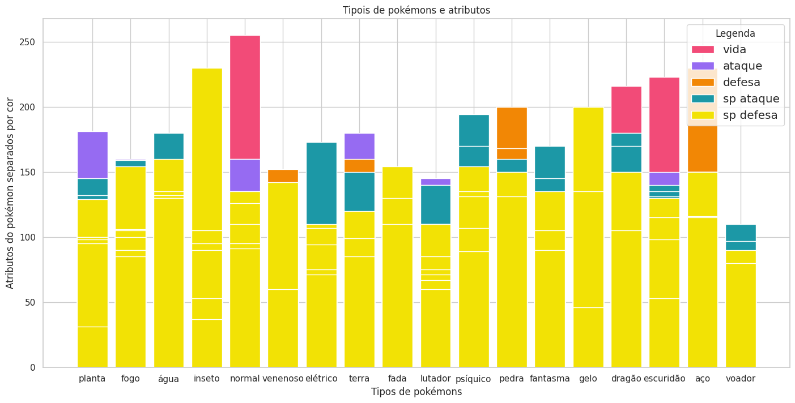
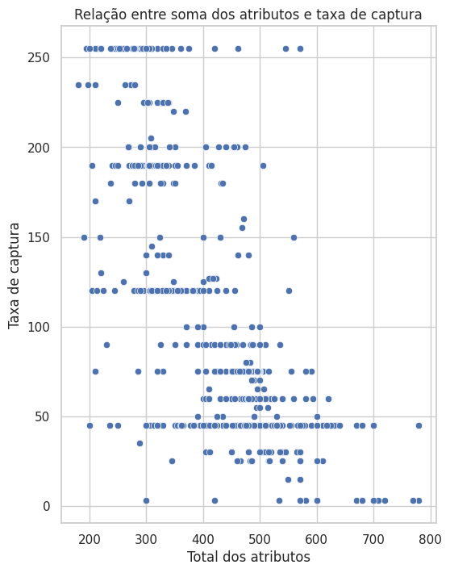
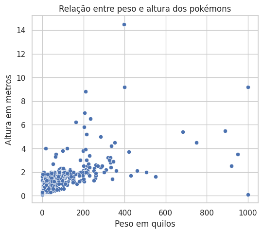

  
  
  
  
  
  
  

# 📈 Projeto de análise de dados de Pokémon utilizando Pandas
## 📢 Descrição do Projeto
### 🎯 Objetivo

  O objetivo deste projeto é explorar, limpar, analisar e visualizar dados de uma base de dados de Pokémon utilizando a biblioteca Pandas do Python. Através desta análise, pretendemos descobrir padrões, tendências e insights sobre as características dos Pokémon e algumas correlações. Este projeto será dividido em várias etapas, incluindo a preparação dos dados, análise exploratória, visualização e interpretação dos resultados.

  O projeto tem caráter experimental e visa a prática do conhecimento.

### 🛠️ Ferramentas utilizadas
<ul>
  <li><b>Python:</b> Linguagem de programação principal.</li>
  <li><b>Pandas:</b> Biblioteca para manipulação e análise de dados.</li>
  <li><b>Matplotlib/Seaborn:</b> Bibliotecas para visualização de dados.</li>
  <li><b>Jupyter Notebook:</b> Ambiente interativo para desenvolvimento e apresentação do projeto</li>
</ul>

## 🚀 Etapas do projeto
### ⛏️ Coleta e preparação dos dados
<ul>
  <li>Importação da base de dados de Pokémon (base de dados encontra-se dentro da pasta /Original.</li>
  <li>Limpeza dos dados: exclusão de colunas que não serão utlizadas. </li>
  <li>Estruturação dos dados para facilitar a análise:</li>
    <ul>
      <li>Tradução de todos valores para a língua portuguesa.</li>
      <li>Alteração de valores "0" e "1" para "False" e "True" na coluna "lendários.</li>
      <li>Criação das colunas "total atr" e "md atr" que são a soma e a média dos atributos respectivamente.</li>
    </ul>
  <li>Análise Exploratória dos Dados (EDA)</li>
</ul>

### 📊 Criação e visualização de Gráficos
<ul>
  <li>Histogramas para analisar a quantidade de pokémons por tipo.</li>
  <li>Gráficos de dispersão para analisar relações entre variáveis.</li>
  <li>Gráficos de barras para análises com tipos de pokemons e atributos (por exemplo, tipos de Pokémon mais forte).</li>
  <li>Interpretação dos Resultados.</li>
</ul>

  
<b>Gráficos</b> ⤵️

    
    
    
    
    
    

### 📄 Resultados e discussões

  Com base nos gráficos gerados foi possível descobri que a maior quantidade de pokémons é do tipo água, normal e planta. Os pokémons mais forte considerando a média dos seus atributos são do tipo água, terra, psíquico e dragões.

  Também foi identificado que os pokémons que possuem maior ataque são do tipo dragão, lutador e terra e os que possuem maior defesa, inclusive superando o ataque são do tipo aço e pedra. Cada tipo de pokémon possui um atributo em destaque que será mostrado na tabela abaixo:

<h4>Tipo de pokémon e principal atributo</h4>
<table border="1">
  <tr><th><b>TIPO</b></th><th><b>ATRIBUTO</b></th><th><b>TIPO</b></th><th><b>ATRIBUTO</b></th><th><b>TIPO</b></th><th><b>ATRIBUTO</b></th></tr>
  <tr><td><b>planta</b></td><td>ataque</td><td><b>fogo</b></td><td>sp ataque</td><td><b>água</b></td><td>sp ataque</td></tr>
  <tr><td><b>inseto</b></td><td>sp defesa</td><td><b>normal</b></td><td>vida</td><td><b>venenoso</b></td><td>defesa</td></tr>
  <tr><td><b>elétrico</b></td><td>sp ataque</td><td><b>terra</b></td><td>ataque</td><td><b>fada</b></td><td>sp defesa</td></tr>
  <tr><td><b>lutador</b></td><td>ataque</td><td><b>psíquico</b></td><td>sp ataque</td><td><b>pedra</b></td><td>defesa</td></tr>
  <tr><td><b>fantasma</b></td><td>sp ataque</td><td><b>gelo</b></td><td>sp defesa</td><td><b>dragão</b></td><td>vida</td></tr>
  <tr><td><b>escuridão</b></td><td>vida</td><td><b>aço</b></td><td>defesa</td><td><b>voador</b></td><td>sp ataque</td></tr>
</table>

  Com base nos gráficos de dispersão foi constatado uma correlação positiva entre o peso e a altura dos pokémons, ficando inclusive perceptível que a maior parte dos pokémons possuem até 200 quilo e até 2 metros de altura. No entanto, entre as variáveis taxa de caotura e total de atributos é possível observar uma correlação negativa, ou seja, a facilidade de captura de um pokémon não está relacionado com o quão forte ele é.

### 💻 Conclusão

  O projeto utilizando Pandas e outras biblioteca Python nos ajuda a compreender melhor a relação dos dados dos pokémons e proporciona insights valiosos para fãs e pesquisadores que tenham interesse em dados de jogos e suas aplicações (exemplo: RPG). Esse projeto gera um novo dataframe com os dados tratados que está disponibilizado no repositório para quem tiver interesse em usar e dar continuidade na análise dos dados, podendo assim fazer analises mais detalhadas.

